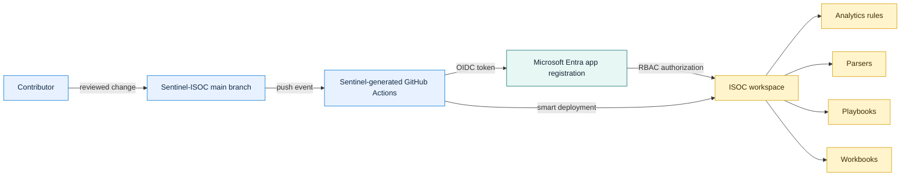
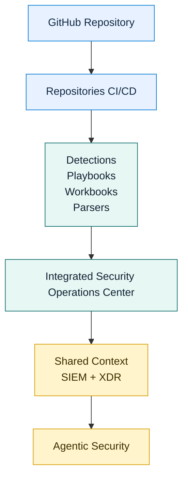

   

## Purpose

Sentinel-ISOC is a public source repository for custom Microsoft Sentinel content managed as code for an Integrated Security Operations Center (ISOC) workspace. A repository connection in the Microsoft Defender portal deploys supported content from the selected GitHub branch.

ISOC brings SIEM and XDR together in a practitioner-focused Microsoft Defender experience. This repository extends that model with GitOps and DevSecOps practices, allowing detection content and automation to be version-controlled, reviewed, tested, and deployed through CI/CD.

This is also a practical foundation for the agentic SOC, where analysts and AI agents operate with shared security signals, context, and controls.

The Microsoft Sentinel repository experience for ISOC is in preview. Capabilities and availability can change.

## Connection and deployment

The Defender repository connection generated the GitHub Actions workflow in `.github/workflows/`. Do not edit or remove the generated workflow manually.

### Deployment flow

### From repository to agentic security

The current connection monitors `main` and is configured for these content types:

* Analytics rules
* Parsers
* Playbooks
* Workbooks

Changes pushed or merged to `main` can start the workflow. Smart deployment is enabled, so it deploys supported content changed since the previous deployment. README-only changes do not add Sentinel content.

Review run logs in the repository's **Actions** tab. The Defender portal's **Microsoft Sentinel > Content management > Repositories** page shows the connection and deployment status.

## Prerequisites

Creating and maintaining this connection requires:

* An eligible tenant with an ISOC workspace
* The **Owner** role on the resource group containing the workspace
* The **Global Administrator** role for initial CI/CD setup
* A home-tenant account for the connection; B2B guest identities aren't supported
* **Collaborator** access to this GitHub repository with GitHub Actions enabled

## Repository contents

The repository currently contains this README and the generated deployment workflow. Add only Microsoft Sentinel-supported content files for the configured content types. The workflow deploys from the repository root.

See Microsoft's guidance for [planning repository content](https://learn.microsoft.com/en-us/azure/sentinel/ci-cd-custom-content#plan-your-repository-content).

## Change and remove content

Develop content on a topic branch, validate and review it, then merge it to `main`. Merging to `main` can trigger deployment to the connected workspace.

Edit connected content in this repository. If you change deployed content in the Defender portal, export those changes back to source control or a later deployment might overwrite them.

Deleting a source file does not remove its deployed content. Remove the corresponding item from the Defender portal as well.

## Security

This repository is public. Do not commit credentials, tokens, customer data, tenant identifiers, or other sensitive information. Use synthetic examples and review changes before merging them to `main`.

The connection uses GitHub Actions with federated identity. Keep authentication material in platform-managed settings, never in repository files.

## References

* [Deploy content from a repository for an ISOC workspace](https://learn.microsoft.com/en-us/defender-xdr/deploy-content-integrated-security-operations?tabs=github)
* [Customize repository deployments](https://learn.microsoft.com/en-us/azure/sentinel/ci-cd-custom-deploy)
